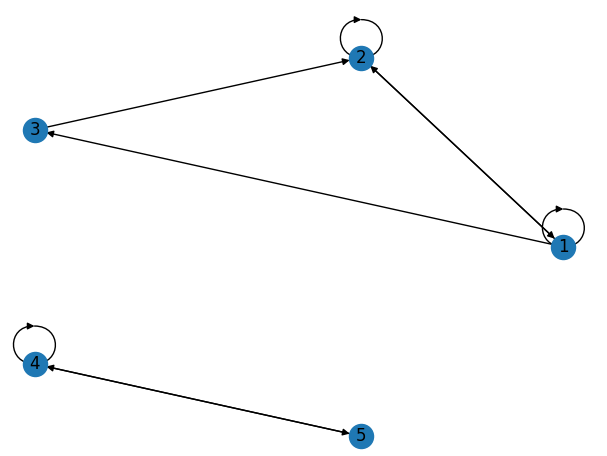
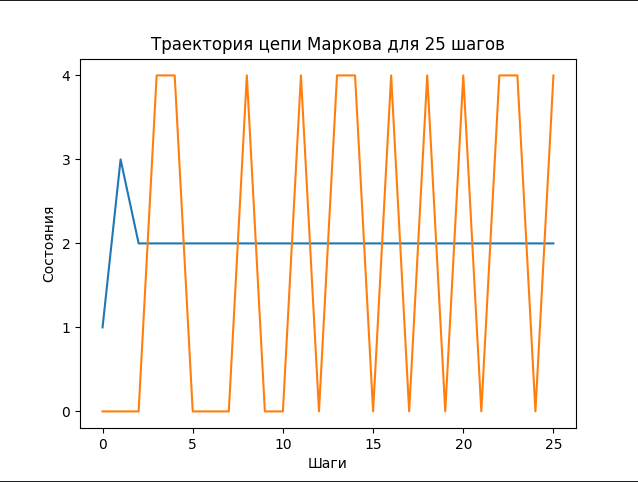

# Описание
Небольшой модуль на Python, позволяющий характеризовать дискретный Марковский процесс. Основные возможности:

| Цель        |Метод |
|:-----------:|:-----------:|
|   Построить граф переходов Марковской цепи  |  ```createTransitionGraph()``` |
|   Визуализация графа переходов  |   ```draw()```  |
|   Описать (циклические подклассы, существенные состояния и их период) |   ```describe()``` |



# Примеры использования / Quickstart
```python
import numpy as np
task = MarkovChain(np.array([
        [1 / 2, 0, 0, 0, 1 / 2],
        [0, 1 / 2, 0, 1 / 2, 0],
        [0, 0, 1, 0, 0],
        [0, 1 / 4, 1 / 4, 1 / 4, 1 / 4],
        [1 / 2, 0, 0, 0, 1 / 2]]))
# MATRICES['5'] - в examples.py содержатся примеры различных матриц перехода
print(task.describe())
print(task.canonicalForm())

```
Характеристики этого процесса:
```
{1, 5}: существенная, период 1 
{3}: существенная, период 1 
{2, 4}: несущественная.
```
$$\begin{pmatrix}
0.5 & 0.0 & 0.0 & 0.0 & 0.5 \\
0.0 & 0.5 & 0.0 & 0.5 & 0.0 \\
0.0 & 0.0 & 1.0 & 0.0 & 0.0 \\
0.0 & 0.25 & 0.25 & 0.25 & 0.25 \\
0.5 & 0.0 & 0.0 & 0.0 & 0.5
\end{pmatrix} \ \implies \begin{pmatrix}
0.5 & 0.5 & 0.0 & 0.0 & 0.0 \\
0.5 & 0.5 & 0.0 & 0.0 & 0.0 \\
\hline
0.0 & 0.0 & 1.0 & 0.0 & 0.0 \\
\hline
0.0 & 0.0 & 0.0 & 0.5 & 0.5 \\
0.0 & 0.25 & 0.25 & 0.25 & 0.25
\end{pmatrix}$$

Сверху представлен переход матрицы в каноническую форму - такая перестановка состояний, чтобы существенные состояния были в верхней левой подматрице, несущественные в нижней.
### Траектории и расчёт стационарного состояния
```python
task.draw_trajectory(25, [np.array([[0, 1/2, 0, 1/2, 0]]), np.array([[1/3, 1/3, 1/3, 0, 0]])])
```

```construct_vt(v0, t)``` позволяет смоделировать вектор $v(t)$, зависящий от количества шагов $t$ и начального распределения $v0$.
Стационарное распределение МЦ можно найти методом ```find_stationary()```:

$$\begin{pmatrix}
0.0 & 0.5 & 0.25 & 0.0 & 0.25 \\
0.167 & 0.0 & 0.0 & 0.833 & 0.0 \\
0.333 & 0.0 & 0.0 & 0.667 & 0.0 \\
0.0 & 0.25 & 0.0 & 0.0 & 0.75 \\
0.125 & 0.0 & 0.0 & 0.875 & 0.0
\end{pmatrix}$$

```python
{1, 2, 3, 4, 5}: существенная, период 2 
Циклические подклассы: [[1, 4], [2, 3, 5]]
[0.0723 0.1431 0.0181 0.4277 0.3389]
```
# Теоретическая справка

### Марковское свойство
Свойство отсутствия памяти, "живи настоящим, а не прошлым". Вероятности перехода в следующие состояния зависят только от того, в каком состоянии система находится сейчас.
$$P(future | \ present, \ past) = P(future | \ present)$$


